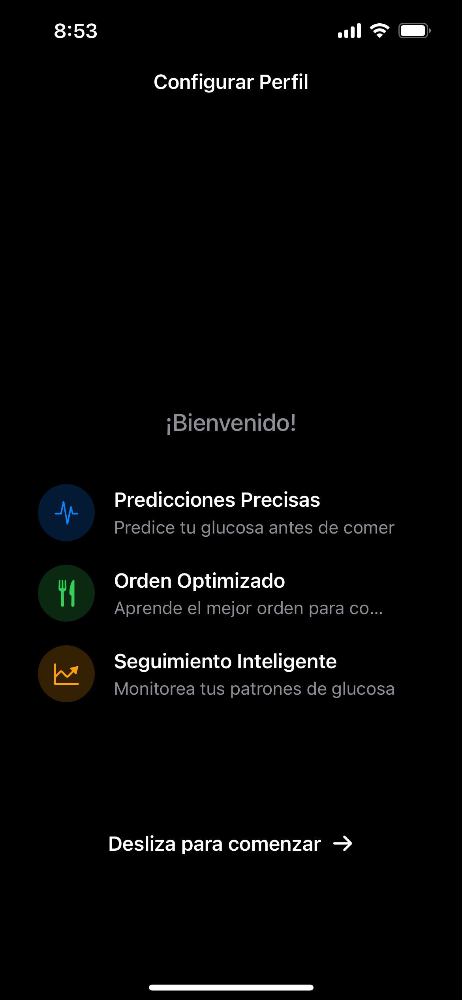
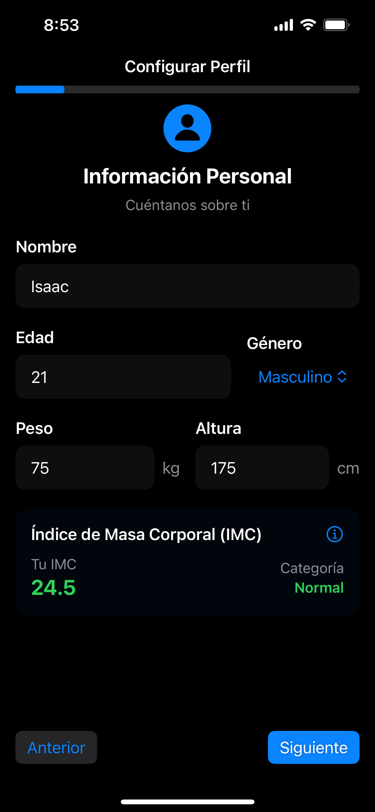
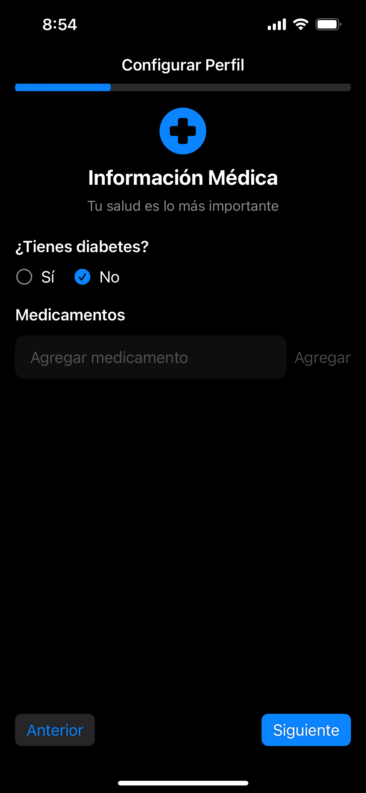
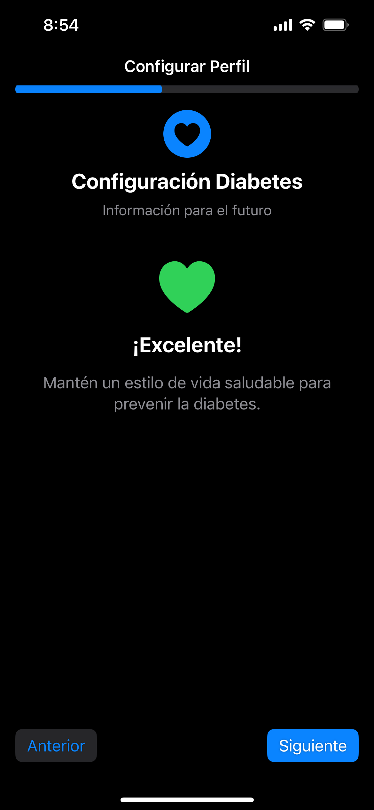
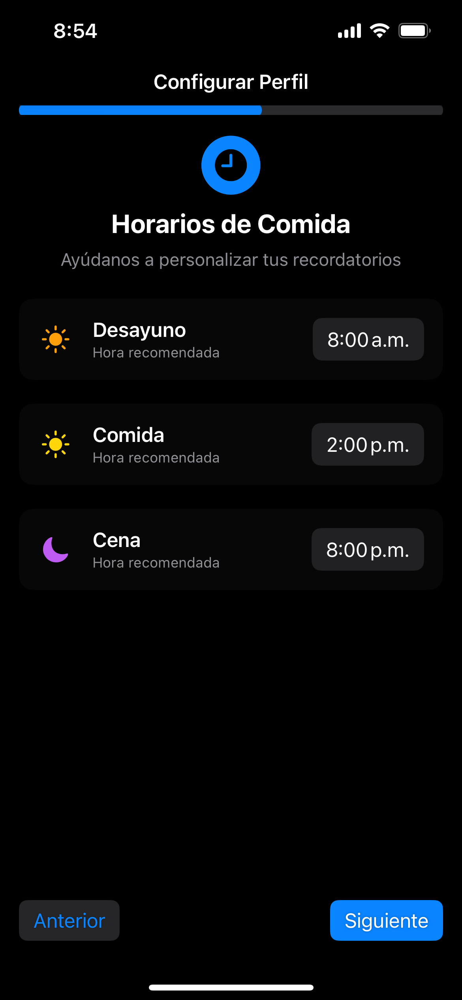
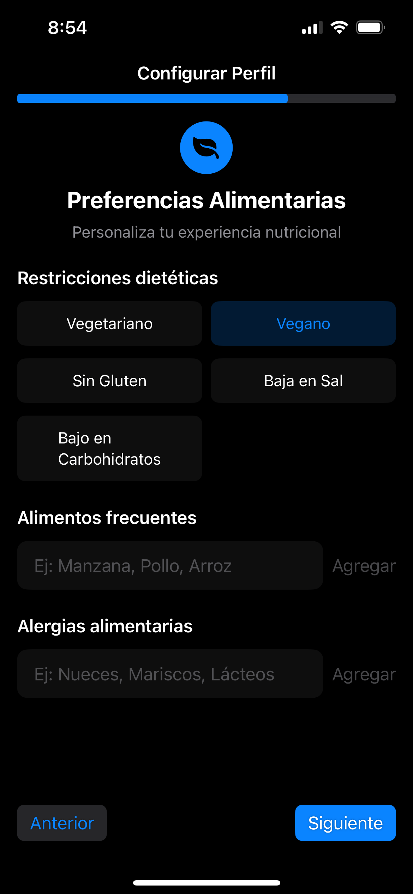
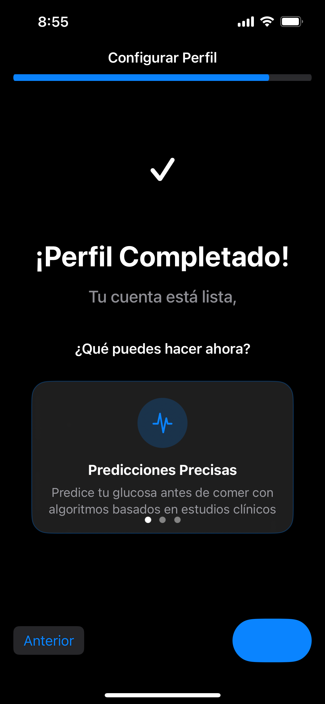
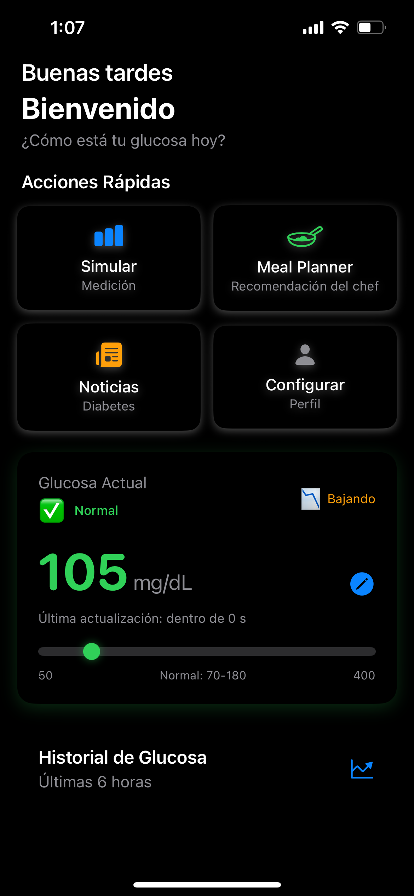
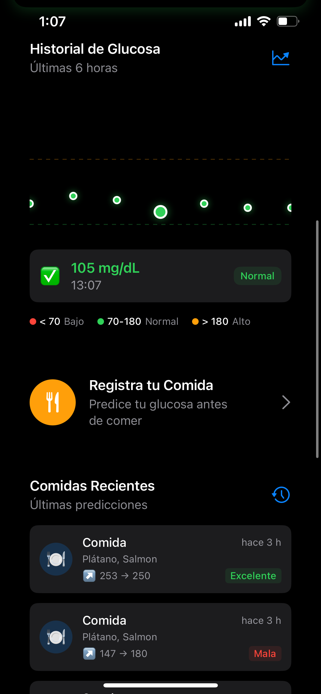
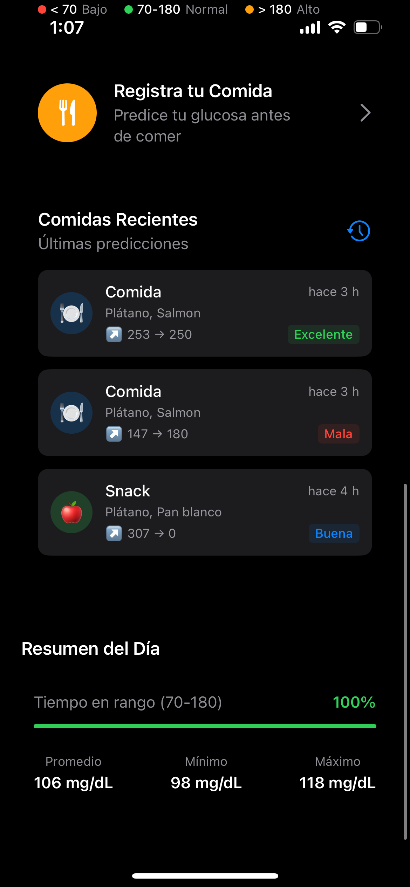

<h1 align="center">GlucoPredict - Predictor de Glucosa Inteligente</h1>

  

  

    Una aplicación iOS nativa desarrollada en SwiftUI que ayuda a personas con diabetes a predecir y controlar sus niveles de glucosa mediante inteligencia artificial y algoritmos basados en estudios clínicos.
     
    <a href="#demo-video">Ver Demo</a>
    ·
    <a href="#screenshots">Capturas del Proyecto</a>
    ·
    <a href="#features">Características</a>
  

<!-- TABLE OF CONTENTS -->

  
Tabla de Contenidos

  <ol>
    <li>
      <a href="#about-the-project">Acerca del Proyecto</a>
      <ul>
        <li><a href="#built-with">Tecnologías Utilizadas</a></li>
        <li><a href="#features">Características Principales</a></li>
      </ul>
    </li>
    <li><a href="#screenshots">Screenshots</a></li>
    <li><a href="#demo-video">Video Demostración</a></li>
    <li><a href="#features-detail">Características Detalladas</a></li>
    <li><a href="#authors">Autores</a></li>
    <li><a href="#features-detail">Validación Clinica</a></li>
    <li><a href="#features-detail">Disclaimers</a></li>
  </ol>

---

<!-- ABOUT THE PROJECT -->
## Acerca del Proyecto

GlucoPredict es una aplicación iOS innovadora diseñada específicamente para personas con diabetes que buscan un mejor control de sus niveles de glucosa. Utilizando algoritmos basados en estudios clínicos y machine learning, la app predice cómo diferentes alimentos y órdenes de comida afectarán los niveles de glucosa postprandial.

### Problema que Resuelve
- **37% de reducción** en picos de glucosa mediante el orden optimizado de alimentos
- **Predicciones precisas** de glucosa antes de comer
- **Planificación inteligente** de comidas personalizadas
- **Cálculo automático** de dosis de insulina

### Tecnologías Utilizadas

- 
- 
- 
- 
- 
- 

### Características Principales

🩸 **Predictor de Glucosa**
- Predicciones basadas en algoritmos clínicos
- Análisis de 1,000+ alimentos
- Factores personalizados (edad, IMC, tipo de diabetes)

🍽️ **Orden Optimizado de Comida**
- Verduras primero: hasta 37% menos pico de glucosa
- Recomendaciones basadas en estudios científicos
- Comparación visual de diferentes órdenes

📊 **Seguimiento Inteligente**
- Gráficas interactivas de predicción
- Historial de comidas y efectividad
- Estadísticas personalizadas

🤖 **Meal Planner con IA**
- Planes semanales personalizados
- Lista de compras automática
- Tips nutricionales específicos

💉 **Calculadora de Insulina**
- Ratios I:C personalizados
- Factor de sensibilidad automático
- Recomendaciones de dosis seguras

---
### Screenshots 

### Onboarding

  
  
  
  
  
  
  

### Dashboard

  
  
  

### Predictor de Glucosa

  
  
  

### Orden de Comida y Comparación

  
  
  

### Meal Planner

  
  
  

### Noticias y Perfil

  
  

---

## Demo Video

¡Mira la aplicación en acción!  

Haz clic en la imagen o [aquí](https://youtu.be/YOUR_VIDEO_ID) para ver la demostración.

---

## Características Detalladas

### 🩸 Predictor de Glucosa Avanzado

El corazón de la aplicación utiliza algoritmos basados en estudios clínicos para predecir niveles de glucosa:

- **Algoritmo de Orden de Comida**: Implementa findings de estudios que muestran reducciones de 17-37% en picos de glucosa
- **Factores Circadianos**: Ajusta predicciones según la hora del día (fenómeno del amanecer)
- **Personalización por Usuario**: Considera edad, IMC, tipo de diabetes y medicamentos
- **Base de Datos Nutricional**: Más de 1,000 alimentos con índice glicémico y carga glicémica

### 📊 Visualización Interactiva

- **Gráficas de Predicción**: Curvas de glucosa predichas en tiempo real
- **Comparación de Órdenes**: Visualización lado a lado de diferentes secuencias
- **Historial Inteligente**: Tracking de efectividad de predicciones anteriores

### 🤖 Meal Planner Personalizado

El planificador de comidas utiliza JSON estructurado para generar:

- **Planes Semanales**: Desayuno, snacks, comida, merienda y cena
- **Balance Nutricional**: Optimizado para control glucémico
- **Lista de Compras**: Generada automáticamente por frecuencia de uso
- **Tips Personalizados**: Basados en el perfil del usuario

## Authors 
### MacAbados team 🦧

<table>
  <tr>
    <td align="center">
      <a href="https://github.com/IsaacRoSosa">
        
         <b>Isaac Rojas </b>
      </a>
       
      
      
    </td> 
    <td align="center">
      <a href="https://github.com/santiagosauma">
        
         <b>Luis Santiago Sauma</b>
      </a>
       
      
      
    </td>
      <td align="center">
      <a href="https://github.com/roccolpz">
        
         <b>Rodrigo López</b>
      </a>
       
      
      
    </td>
      </td>
      <td align="center">
      <a href="https://github.com/RodrigoGarciaT">
        
         <b>Rodrigo Garcia</b>
      </a>
       
      
      
    
    
  </tr>
</table>

## Validación Clínica

### Estudios Base

La aplicación se fundamenta en investigación peer-reviewed:

1. **Shukla et al. (2015)** - Diabetes Care
  - 37% reducción en pico glucémico con verduras primero
  - Estudio con 16 participantes con diabetes tipo 2

2. **Shukla et al. (2016)** - Diabetes Care
  - 20% reducción en insulina postprandial
  - Protocolo: Verduras/proteínas → esperar 15 min → carbohidratos

3. **Imai et al. (2013)** - European Journal of Clinical Nutrition
  - Validación en población japonesa
  - Confirmación de efectos en diferentes etnias

### Limitaciones y Disclaimers

⚠️ **Importante**:
- Esta app es una **herramienta educativa**, no un dispositivo médico
- Las predicciones son **estimaciones** basadas en promedios poblacionales
- **Siempre consulta** con tu equipo médico antes de cambios en tratamiento
- **No reemplaza** la medición real de glucosa

---

[🔼 Back to top](#readme-top)

