
<h1 align="center"> GlucoPredict - Intelligent Glucose Predictor </h1>

  

  

    A native iOS application developed in SwiftUI that helps people with diabetes predict and control their glucose levels using artificial intelligence and algorithms based on clinical studies.
     
    <a href="#demo-video">View Demo</a>
    ·
    <a href="#screenshots">Project Screenshots</a>
    ·
    <a href="#features">Features</a>
  

<!-- TABLE OF CONTENTS -->

  
Table of Contents

  <ol>
    <li>
      <a href="#about-the-project">About The Project</a>
      <ul>
        <li><a href="#built-with">Built With</a></li>
        <li><a href="#key-features">Key Features</a></li>
      </ul>
    </li>
    <li><a href="#screenshots">Screenshots</a></li>
    <li><a href="#demo-video">Demo Video</a></li>
    <li><a href="#detailed-features">Detailed Features</a></li>
    <li><a href="#authors">Authors</a></li>
    <li><a href="#clinical-validation">Clinical Validation</a></li>
    <li><a href="#disclaimers">Disclaimers</a></li>
  </ol>

---

<!-- ABOUT THE PROJECT -->
## About The Project

GlucoPredict is an innovative iOS application designed specifically for people with diabetes seeking better control of their glucose levels. Using algorithms based on clinical studies and machine learning, the app predicts how different foods and meal orders will affect postprandial glucose levels.

### Problem it solves
- **37% reduction**  in glucose spikes through optimized food ordering
- **Accurate predictions** of glucose before eating
- **Inteligent meal planning** with personalized recommendations
- **Automatic calculation** of insulin doses

### Build witth
- 
- 
- 
- 
- 
- 

### Key Features

🩸 **Glucose Predictor**
- Predictions based on clinical algorithms
- Analysis of 1,000+ foods
- Personalized factors (age, BMI, diabetes type)

🍽️ **Optimized Meal Order**
- Vegetables first: up to 37% less glucose spike
- Recommendations based on scientific studies
- Visual comparison of different orders

📊 **Intelligent Tracking**
- Interactive prediction graphs
- Meal history and effectiveness
- Personalized statistics

🤖 **AI-Powered Meal Planner**
- Personalized weekly plans
- Automatic shopping list
- Specific nutritional tips

💉 **Insulin Calculator**
- Personalized I:C ratios
- Automatic sensitivity factor
- Safe dose recommendations

---

### Screenshots 

### Onboarding

  
  
  
  
  
  
  

### Dashboard

  
  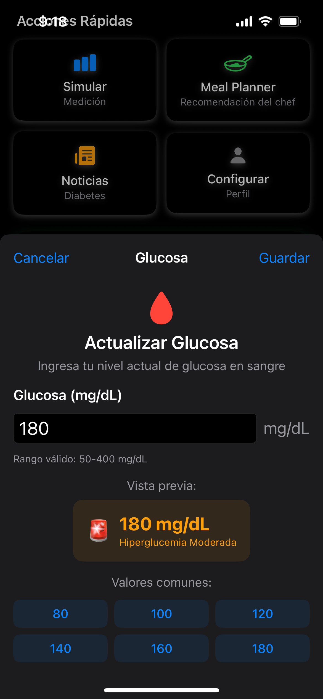
  
  

### Glucose Predictor

  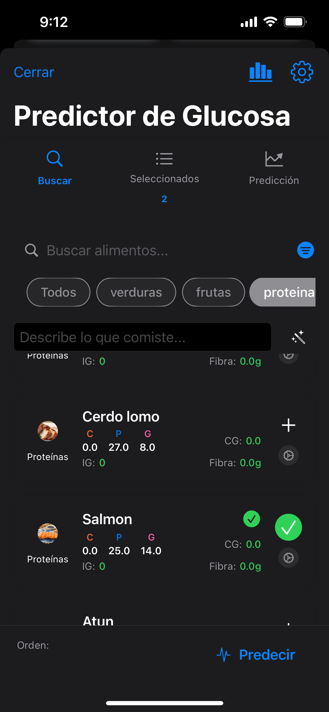
  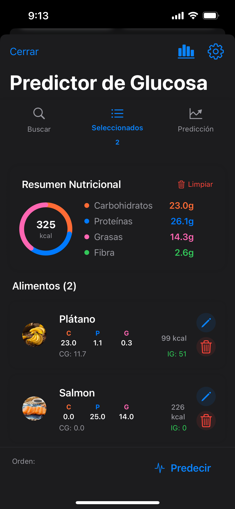
  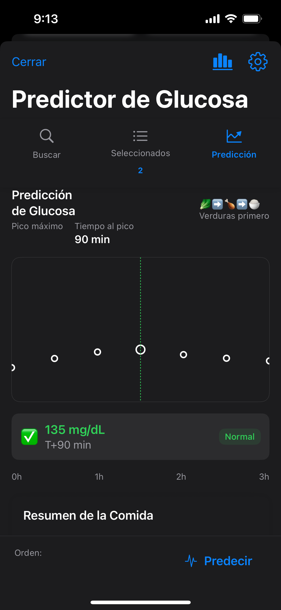
  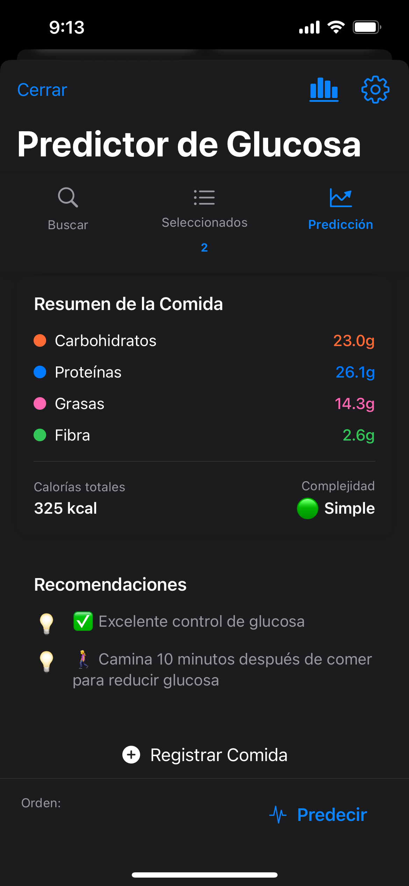
  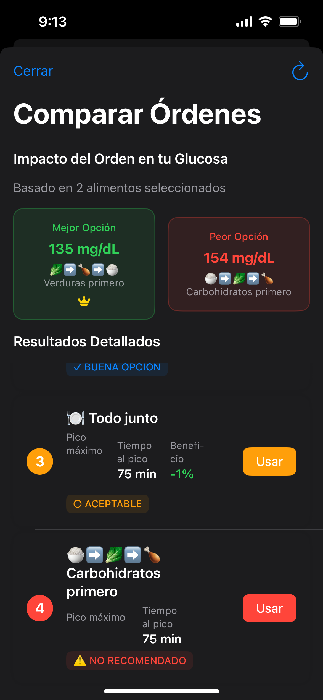  

### Recent Meals & Meal Planner

  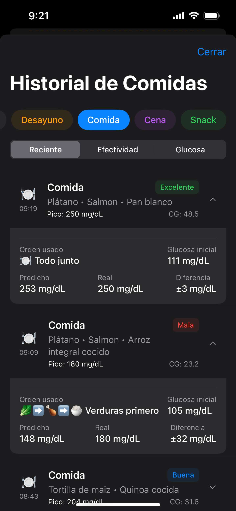
  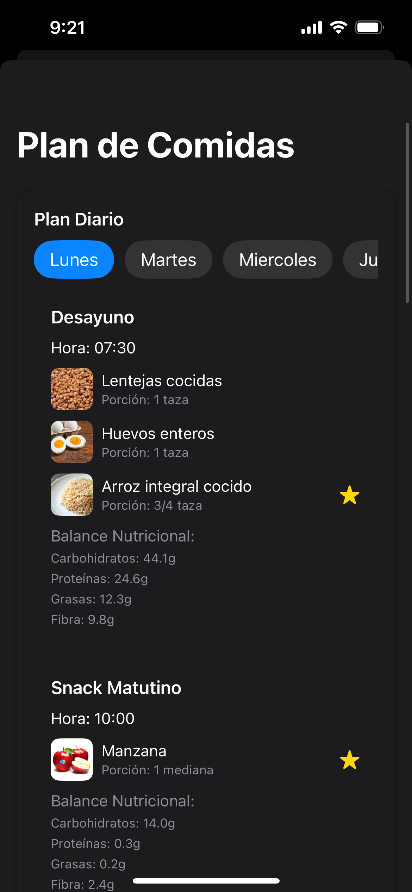
  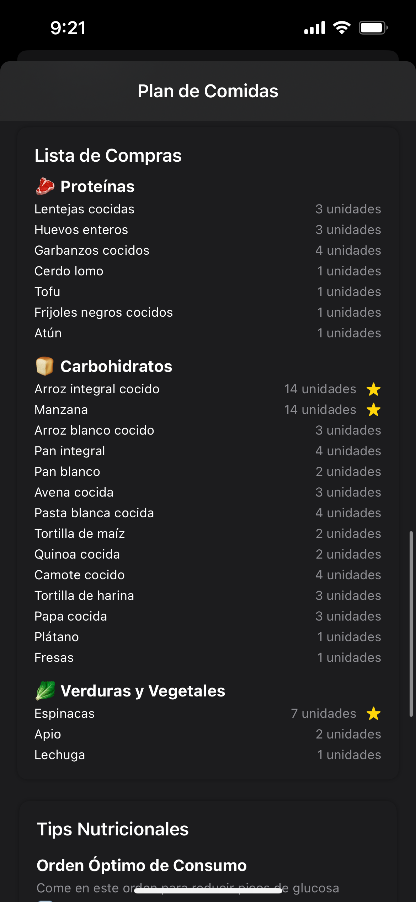
  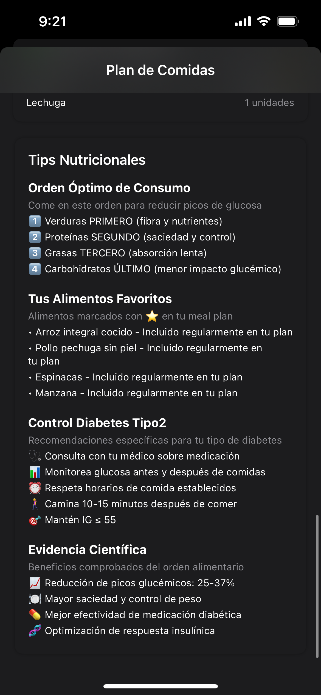

### Noticias y Perfil

  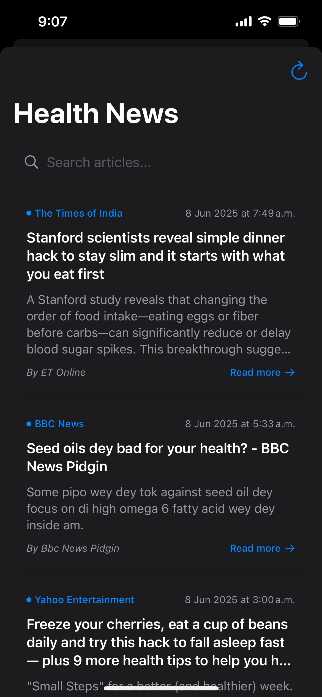
  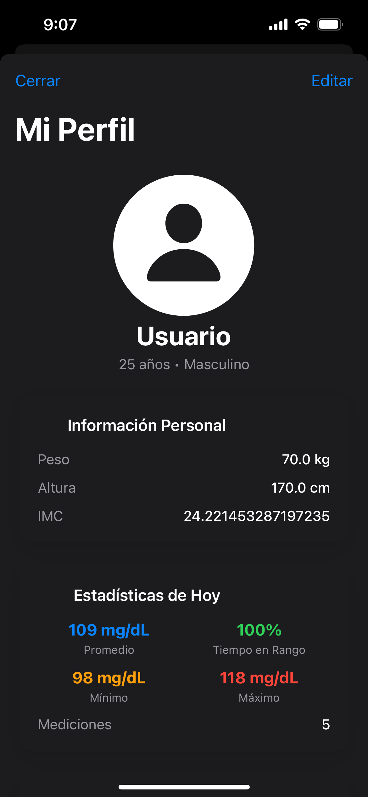
  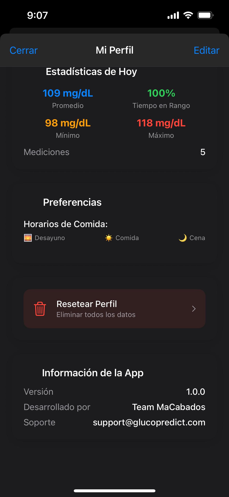

---

## Demo Video

Watch the application in action!

Click on the image on [aquí](https://youtu.be/YOUR_VIDEO_ID) to view the demonstration.

---

## Detailed Features

### 🩸 Advanced Glucose Predictor
The heart of the application uses algorithms based on clinical studies to predict glucose levels:

- **Meal Order Algorithm**: Implementa findings de estudios que muestran reducciones de 17-37% en picos de glucosa
- **Circadian Factors**: Adjusts predictions based on time of day (dawn phenomenon)
- **User Personalization**: Considers age, BMI, diabetes type, and medications
- **Nutritional Database**: Over 1,000 foods with glycemic index and glycemic load

### 📊 Interactive Visualization

- **Prediction Graphs**: Real-time predicted glucose curves
- **Order Comparison**: Side-by-side visualization of different sequences
- **Ingelligent History**: Tracking effectiveness of previous predictions

### 🤖 Personalized Meal Planner

The meal planner uses structured JSON to generate:

- **Weekly Planss**: Breakfast, snacks, lunch, afternoon snack, and dinnerc
- **Nutritional Balance**: Optimized for glycemic control
- **Shopping List**: Automatically generated by frequency of use
- **Personalized Tips**: Based on user profile

## Authors 
### MacAbados team 🦧

<table>
  <tr>
    <td align="center">
      <a href="https://github.com/IsaacRoSosa">
        
         <b>Isaac Rojas </b>
      </a>
       
      
      
    </td> 
    <td align="center">
      <a href="https://github.com/santiagosauma">
        
         <b>Luis Santiago Sauma</b>
      </a>
       
      
      
    </td>
      <td align="center">
      <a href="https://github.com/roccolpz">
        
         <b>Rodrigo López</b>
      </a>
       
      
      
    </td>
      </td>
      <td align="center">
      <a href="https://github.com/RodrigoGarciaT">
        
         <b>Rodrigo Garcia</b>
      </a>
       
      
      
    
    
  </tr>
</table>

## Validación Clínica

### Base Studies

The application is based on peer-reviewed research:

1. **Shukla et al. (2015)** - Diabetes Care
  - 37% reduction in glucose peak with vegetables first
  - Study with 16 participants with type 2 diabetes

2. **Shukla et al. (2016)** - Diabetes Care
  - 20% reduction in postprandial insulin
  - Protocol: Vegetables/proteins → wait 15 min → carbohydrates

3. **Imai et al. (2013)** - European Journal of Clinical Nutrition
  - Validation in Japanese population
  - Confirmation of effects across different ethnicities

### Limitaciones y Disclaimers

⚠️ **Importante**:
- This app is an **educational tool**, not a medical device
- Predictions are **estimates** based on population averages
- **Always consult** with your medical team before treatment changes
- **Does not replace** actual glucose measurement
---

[🔼 Back to top](#readme-top)

